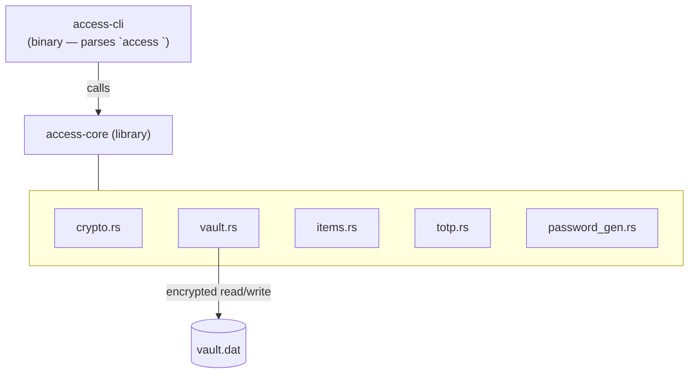
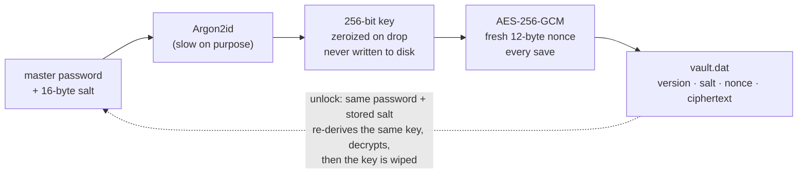

# Access — System Map

A personal password manager built from scratch in Rust — a learning project modeled on Bitwarden/LastPass, run entirely offline for now.

`Phase 1 of 5` · `Cargo workspace` · `Argon2id + AES-256-GCM` · `zero plaintext on disk`

---

## Crates & modules

Two crates: a binary that only parses commands, and a library that owns every secret. The CLI never touches encryption directly — it always goes through `access-core`.

The CLI never sees a raw key or plaintext item — it only calls into `access-core`, and `vault.rs` is the only module allowed to touch the vault file.

---

## How the vault locks and unlocks

The mechanism the whole project hinges on: turning a memorized password into a key, and never letting that key survive on disk or linger in memory.

Nothing plaintext ever reaches disk: the key exists only in memory, only as long as the vault is open, and is zeroized the moment it's dropped.

---

## Roadmap

Five phases, built in order. Phase 1 is the only one in progress — nothing later gets started until the vault engine and CLI are solid.

| # | Phase | Description | Status |
|---|-------|-------------|--------|
| 01 | **Core vault engine + CLI** | Crypto module, vault file format, and the `access` command itself — init, add, get, list, edit, rm, password generator, TOTP. | 🟠 in progress — task 0.2 next |
| 02 | Self-hosted sync server | Zero-knowledge sync — the server stores only ciphertext, never a key or plaintext item. | ⬜ not started |
| 03 | Desktop GUI | A windowed app on top of access-core, replacing the terminal for day-to-day use. | ⬜ not started |
| 04 | Browser extension | Autofill for logins directly in the browser. | ⬜ not started |
| 05 | Mobile app | Stretch goal — vault access on a phone. | ⬜ stretch |

---

## Command surface

The full `access` CLI as planned for phase 1 — none of it is built yet, this is the target shape.

**Vault**
- `access init` — create a new vault
- `access list` — show saved item names

**Items**
- `access add <name>` — save a login
- `access add --note <name>` — save a note
- `access get <name>` — copy password to clipboard
- `access edit <name>` — update an item
- `access rm <name>` — delete an item

**Generator**
- `access generate` — random password
- `access add --generate <name>` — generate + save in one step

**TOTP (2FA)**
- `access totp add <name> <secret>` — attach a 2FA secret
- `access totp <name>` — show the current 6-digit code

---

**Now:** task 0.2 — workspace `Cargo.toml` + empty crates, confirm `cargo build` works.
